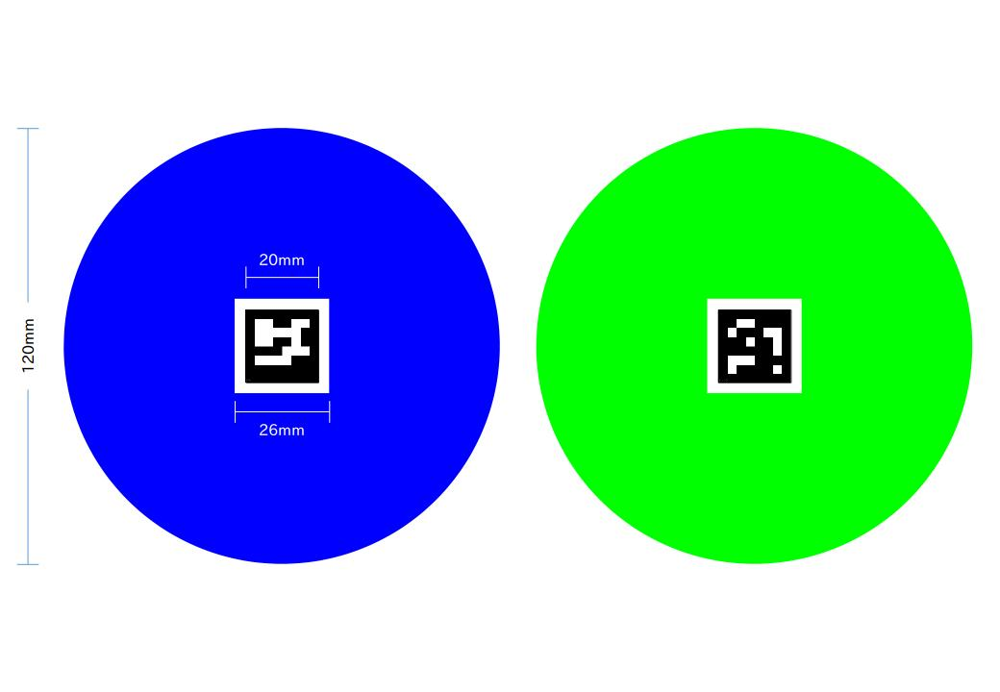

# onigiri war ルール
※基本的なルールは決定しましたが、
検証状況に応じて、障害物の配置やポイント配分などを当日までに微調整をする場合があります。
変更があった場合は、なるべく早くお知らせいたします。

## 概要

「onigiri war」は、ロボットを自律移動させ、１対１で撃ち合うゲームです。

主砲の代わりに、正面のカメラでターゲット(ARマーカー)を読み取ります.

ターゲットから読み取ったIDを審判サーバーに提出すると、その的を撃ち落としたという扱いになります。

ロボットは完全自律とし、スタート後は手動でのいかなる操作も禁止します。

## フィールド

**3.5m**四方の壁で囲われたフィールド内で競技を行う。
競技フィールド（以下、お弁当箱）は、お弁当箱をモチーフにしている。
競技フィールド内には、おかず型の障害物（以下、おかず）を設置する。
"おかず"は、常に同じ位置に初期設置する。
"おかず"は、動かないように床面に固定して設置している。
"おかず"が動いた場合も試合は続行する。
"お弁当箱"は、ロボットで押しても動かないように固定する。
床面は会場の板張りの床をそのまま使用する。

## 勝敗の決定方法
ターゲットから読み取ったIDを審判サーバーに提出すると、そのターゲットを撃ち抜いたと扱う。
ターゲットを撃ち抜くと、ポイントを獲得できる。
相手背後のターゲットは、撃ち抜いた瞬間に勝利確定（1本勝ち）とするします。

配点
- 相手背後   ： 勝利確定
- 相手左右   ： 5ポイント
- フィールド ：１ポイント

**制限時間３分間**以内に１本勝ち、または終了時にポイントが多いチームの勝利とする。
両チーム同点の場合は、最終ポイントを獲得した時刻が早いチームの勝利とする。
両チームポイント無しで終了した場合は、チームの代表者によるじゃんけんで勝敗を決める。

審判へ提出するターゲットIDを10回間違えると、その時点で失格とする。

機体に著しい負担がかかり故障や事故が予想されるなど、審判が危険と判断した場合は試合を中断し、失格とする場合がある（レフェリーストップ）。

競技者が競技中にコース内に入ることは認めない。

## リトライ
各チームに、開始15秒以内はリトライの権利を与える。
リトライは、チームの代表者が「リトライ」と宣言することで成立する。
リトライ権は、1試合につき、各チーム1回づつとする。
リトライが宣言されたら、**3分間**のインターバルタイム経過後に試合を再開する。
※本ルールは、トラブルによりマシンが全く動かない場合や初期化のミスなどへの救済措置です。

## ターゲット

**ターゲット画像**


**ターゲット配置**


ターゲットは直径12ｃｍの円形、中心にARマーカーを印刷している。

機体に取り付けるターゲットと、フィールどに設置されたターゲットがあり、機体のターゲットは緑、フィールドのターゲットは青色をしている。

**機体のターゲット**は、上の画像のように左右１枚づつ、背後１枚の計**3枚**。**フィールドのターゲット**は点対称に**12枚**設置する。

## 開始シーケンス
開始地点にロボットをセットした状態を、開始待ち状態とする。
開始待ち状態から、審判の開始の合図のに後に機体が動いた段階で開始完了とする。
審判の開始の合図より前に機体を動かした場合は、再度両者を開始待ち状態に戻す。(フライング)
フライング3回で失格とする。
フライングの判断は審判が行う。
開始完了までは、スイッチの押下、SSH接続による操作など、手動での操作を許可する。

審判の開始の合図の後、速やかにロボットを動作開始させるものとする。
ロボットが動いた段階で開始完了とみなし、それ以降の手動での操作は禁止する。

開始待ちの状態で、ロボットの電源を入れ、プログラムの起動、初期化、パラメータの読み込み、審判サーバーへの接続確認などの処理を行うことを許可する。
審判の開始の合図まで移動すること(フライング)がないようにご注意ください。

## ロボット
ロボットはONIGIRI_BOT使用する。

以下のセンサを使用できる。
- カメラ：realsense r200 
- Lidar ：日立LG　Lidar
- 左右斜め前方赤外線測距センサ 2個
- 前方バンパースイッチ　2個

## 外部PCの使用
ロボットにはJetsonTX1が搭載されており、単体でROSを動かすことが出来る。
それに加えて、計算負荷分散やモニタリングのためにロボット以外の外部PCを試合で使用することを許可する。
チーム毎にIPを割り当てますので、必ず指定されたIPをご使用ください。
また、ネットワークに著しい負荷をかける行為はお控えください。

ex)/imgae_raw トピックの転送. commpressed imgageなどサイズの小さい画像をご使用ください。


--------------------------------

# 大会運営
## ネットワーク
各チームに固定のIPを3(個程度の予定)振り分ける。
ロボットや、外部PCは割当のIPを使用すること。
全チームがネットワークを共有する予定のため、重たい生動画の転送などネットワークに著しく負荷をかける行為はお控えください。


## タイムスケジュール
第3回One Night ROBOCON（以下、本ロボコン）は、以下のタイムスケジュールで執り行う。
```
　　12/8(金)	18:30～		参加者受付
		19:00		開会式
		19:30		開発作業開始
　　12/9(土)	12:00		開発作業終了
		13:00		初級コース競技開始
		14:30		中級コース競技開始
		16:00		表彰式
		17:00		懇親会
```
	※時刻は目安で、進行により前後することがある。

## 機体
各チームに、ONIGIRI型ロボット一台を支給する

各チームは支給されたセットを用いて制御プログラムを作成する。

本番競技時も各チームに割り当てられた機体を使用する。

支給セットの配布は、開会式後に、実行委員長の号令により、各チームの代表が所定の位置に配置されている任意の支給セットを取得することで行う。

開発作業中に、機体の部品が故障・破損した際は、実行委員会の判断により、実行委員会管理の予備部品と交換する。（予備には限りがありますので、交換に応じられ
ない場合もあります。）

競技中に、機体が故障・破損した場合、機体の故障・破損について、競技者に過失がない場合は、実行委員会にて対応を判断する。

各チームは、支給セットの取得直後に、支給された各パーツに、自チームのチーム番号に対応するテプラ（別途支給）を貼ること。

## 開発作業
参加者は、開発作業時間中に、以下を開発する。
-	制御用プログラム
-	アピール用プレゼン資料（Power Point 1枚）

開発用の端末に関する制限はない。

開発用の端末は各自で準備するものとする。（実行委員会では開発用の端末は提供しない。）

開発作業用スペースはセミナールームを使用する。セミナールーム内の場所は、各チームのチーム番号に基づき、実行委員会にて事前に割り当てを行う。

開発中は検証用として本番用のコースをHUBに設置する。（コースを用いた検証は譲り合って実施ください。長時間の占有はご遠慮ください。）

他チームの迷惑となる行為は禁止する。

その他、開発作業中にて不明な点が生じた場合は、One Night ROBOCON実行委員長が判断を行う。

## 成果物の回収
開発時間終了後、実行委員会にて、各チームのロボット機体、ソフトウェアのソースコード、プレゼン資料を回収する。

回収物の差し替えは原則不可とする。

## 競技
競技はトーナメント形式で行う。


